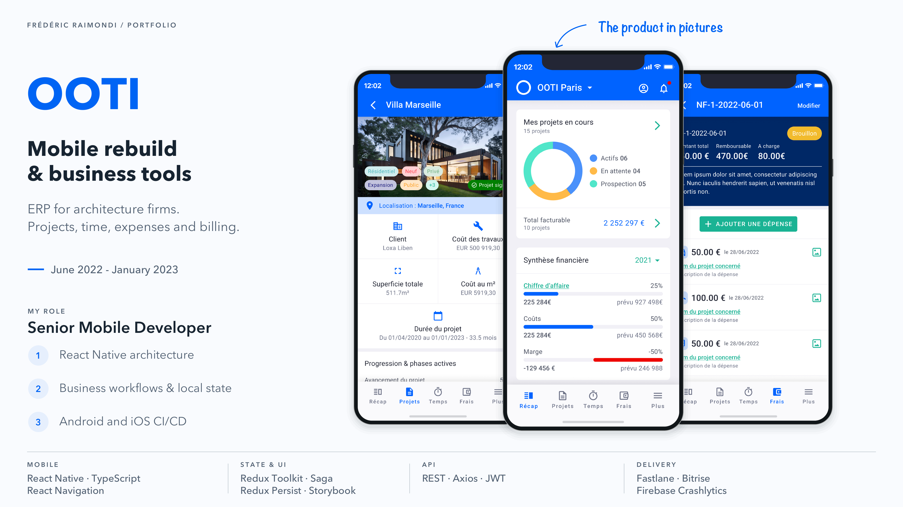
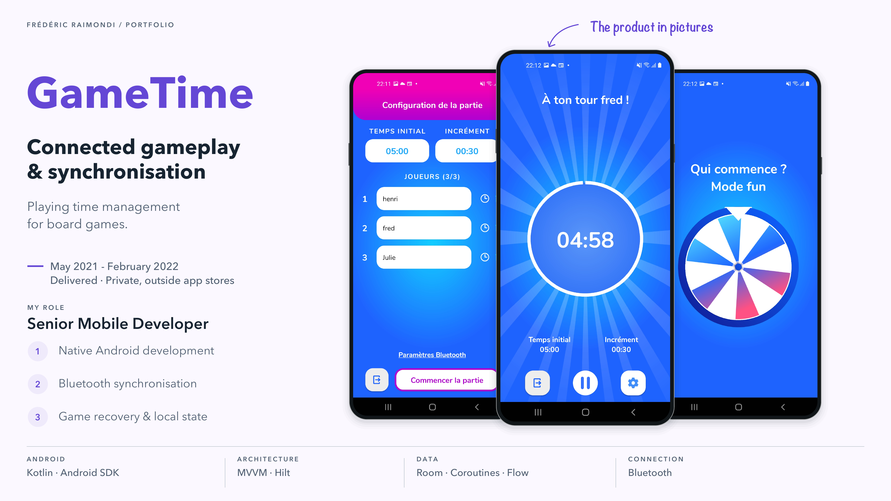
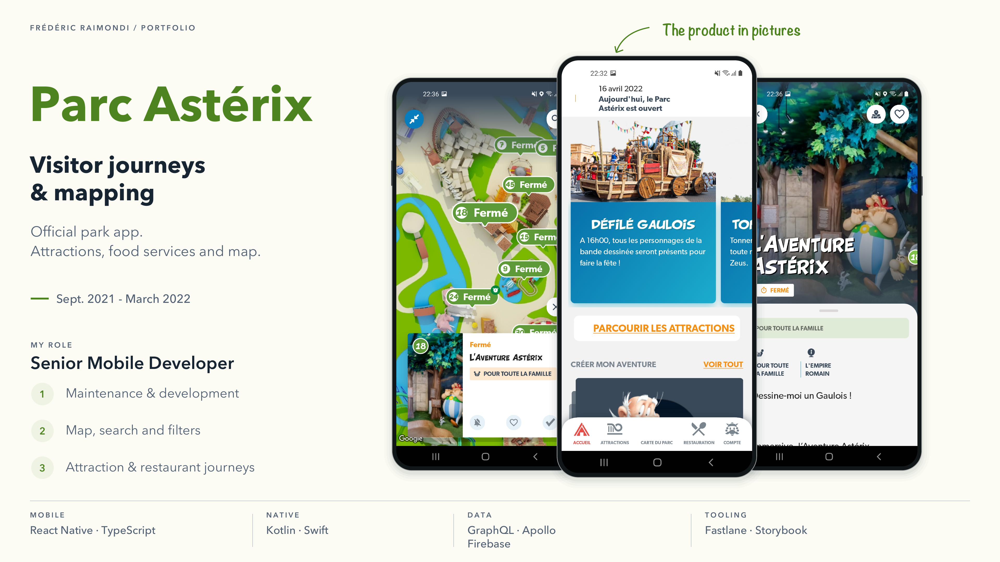
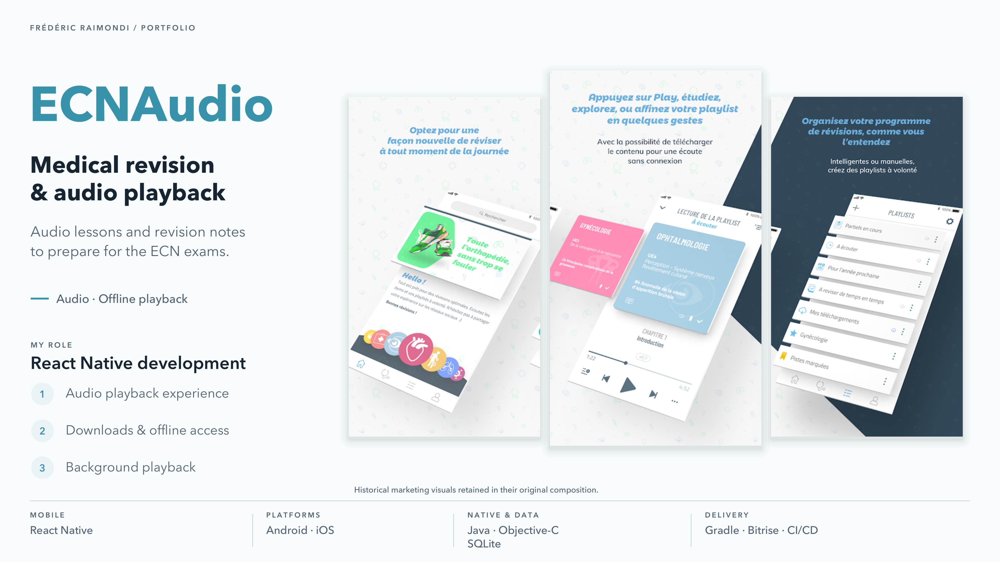
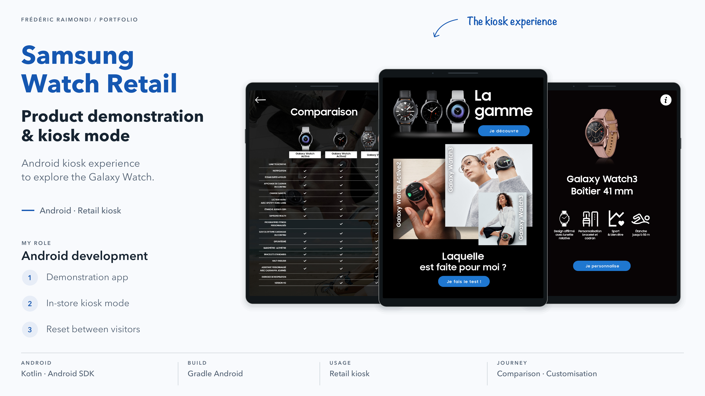

# Frédéric Raimondi

## Senior Mobile Developer

**Android / Kotlin · React Native / TypeScript**

I’m a senior mobile developer and the founder of DevAxes, based in Nice, France. I have more than fourteen years of experience in mobile development, working with native Android in Kotlin and React Native in TypeScript for Android and iOS.

I build new apps and take over existing ones, from architecture to app store delivery and ongoing development. Depending on the project, I join the team as a developer or take on technical leadership, including code reviews, CI/CD and mentoring.

Here you’ll find the projects I’ve contributed to, my role and the skills involved. To discuss your app, you can contact me on [LinkedIn](https://www.linkedin.com/in/freddev06) or [Malt](https://www.malt.fr/profile/fredericraimondi).

---

## Projects

### [Feel](projets/feel.md)

Mobile mental health and wellbeing app. Android/iOS rebuild, maintenance and product development in a Tech Lead Mobile role.

**Skills:** React Native · TypeScript · Kotlin · mobile architecture · technical leadership.

[Explore the project](projets/feel.md)

---

### [OOTI](projets/ooti.md)

Rebuild of OOTI's iOS and Android apps, an ERP for architecture firms. Project workflows, time entry, expenses and approvals in React Native.

**Skills:** React Native · TypeScript · Redux/Saga · REST API · mobile CI/CD.

[Explore the project](projets/ooti.md)

---

### [Sauv'Life](projets/sauvlife.md)

Android/iOS mobile rebuild engagement for Sauv’Life, an app for volunteer responders alerted by French emergency medical services (SAMU). Geolocation, navigation and degraded networks.

**Skills:** React Native · TypeScript · geolocation · WebRTC · operation on degraded networks.

[Explore the project](projets/sauvlife.md)

---

### [GameTime](projets/gametime.md)

Android time-management app for board games, with Bluetooth synchronisation and game recovery. Delivered and distributed within a private circle, outside the app stores.

**Skills:** Kotlin · Android · Bluetooth · MVVM · Room.

[Explore the project](projets/gametime.md)

---

### [Hoop Hook](projets/hoop-hook.md)

Connected basketball Android app delivered to the client. Bluetooth connection to the sensor, state monitoring and several game modes.

**Skills:** Kotlin · Android · Bluetooth Low Energy · Hilt · Firebase.

[Explore the project](projets/hoop-hook.md)

---

### [Application Parc Astérix](projets/parc-asterix.md)

Maintenance and development of the official Parc Astérix iOS and Android app: map, search, attractions and food services, in React Native.

**Skills:** React Native · TypeScript · GraphQL · mobile mapping · Firebase.

[Explore the project](projets/parc-asterix.md)

---

### [OOPET Love](projets/oopet-love.md)

Social Android app for pet owners: profiles, messaging, and photo and video sharing, based on a Kotlin foundation shared with OOPET Lost.

**Skills:** Kotlin · Android Jetpack · mobile messaging · media management · Firebase.

[Explore the project](projets/oopet-love.md)

---

### [Laundrapp](projets/laundrapp.md)

On-demand laundry Android apps: maintenance of the customer app and creation of the courier app, with routes and location tracking.

**Skills:** Android · Java · Google Maps · NFC provisioning · mobile CI/CD.

[Explore the project](projets/laundrapp.md)

---

### [Olfaplay](projets/olfaplay.md)

Contribution to the mobile apps for Olfaplay, Guerlain's audio platform: story recording, streaming and moderation. Work through Big Boss Studio.

**Skills:** mobile development · iOS · Android · audio recording · audio streaming.

[Explore the project](projets/olfaplay.md)

---

### [TSF Jazz](projets/tsf-jazz.md)

React Native mobile development for the TSF Jazz app: live radio, podcasts, themed streams and editorial content on iOS and Android.

**Skills:** React Native · iOS · Android · audio streaming · media player.

[Explore the project](projets/tsf-jazz.md)

---

### [ECNAudio](projets/ecnaudio.md)

ECNAudio prepared medical students for the French national ranking examinations. I developed the React Native app: audio lessons, downloadable notes and offline listening.

**Skills:** React Native · mobile development · audio playback · offline downloading · background playback.

[Explore the project](projets/ecnaudio.md)

---

### [Samsung Watch Retail](projets/samsung-watch-retail.md)

Galaxy Watch Android demonstration app on an in-store kiosk, with kiosk mode and reset between visitors. Project carried out as subcontracting work.

**Skills:** Kotlin · Android · kiosk mode · session reset · kiosk integration.

[Explore the project](projets/samsung-watch-retail.md)

---

### [AXA Drive](projets/axa-drive.md)

Responsibility for the native Android AXA Drive app at Big Boss Studio, covering journeys, weather and traffic alerts, and driving monitoring.

**Skills:** native Android and responsibility for the app.

[Explore the project](projets/axa-drive.md)

---

### [Nissan Qashqai](projets/nissan-qashqai.md)

Complete development in Java of an Android tablet app presenting the Nissan Qashqai, at Big Boss Studio.

**Skills:** Java · Android · tablet · interactive media · augmented reality.

[Explore the project](projets/nissan-qashqai.md)

---

### [Anaca3 - Scan minceur](projets/anaca3.md)

Maintenance of the Anaca3 mobile app at Big Boss Studio. The product let users scan a food item and view a score and alternatives.

**Skills:** mobile app maintenance.

[Explore the project](projets/anaca3.md)

---

### [Kréa](projets/krea.md)

Lead development of the C#/.NET Kréa desktop editor and its Lua generation engine for Corona SDK mobile projects.

**Skills:** C#/.NET · WPF · Lua · code generation · Corona SDK.

[Explore the project](projets/krea.md)

---

