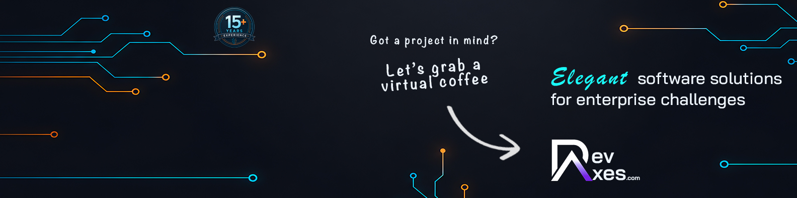
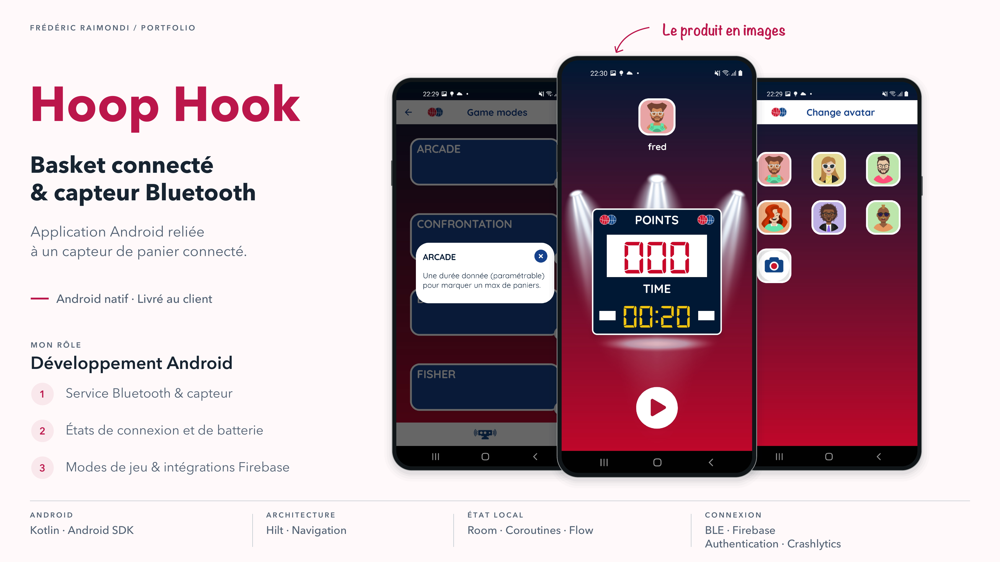
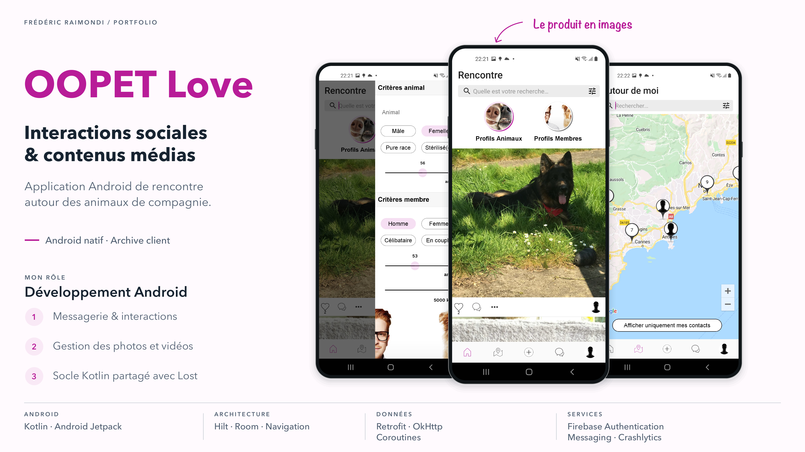
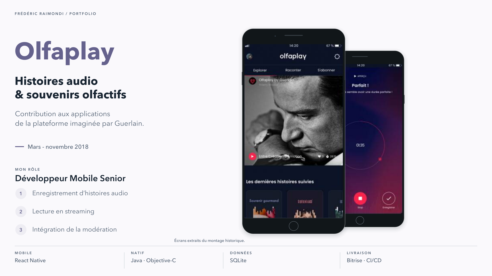

# Frédéric Raimondi

## Développeur Mobile Senior

**Android / Kotlin · React Native / TypeScript**

Je suis développeur mobile senior et fondateur de DevAxes, à Nice. J’ai plus de quatorze ans d’expérience en développement mobile, en Android natif avec Kotlin et en React Native avec TypeScript pour Android et iOS.

Je travaille sur la création, la reprise et l’évolution d’applications, de l’architecture à la livraison sur les stores. Selon le projet, j’interviens en renfort de l’équipe ou comme référent technique, avec la revue de code, la CI/CD et l’accompagnement des développeurs.

Vous trouverez ici les projets auxquels j’ai contribué, mon rôle et les compétences mobilisées. Pour échanger sur votre application, vous pouvez me contacter sur [LinkedIn](https://www.linkedin.com/in/freddev06) ou sur [Malt](https://www.malt.fr/profile/fredericraimondi).

---

## Projets

### [Feel](projets/feel.md)

Application mobile de santé mentale et de bien-être. Refonte Android/iOS, maintenance et évolutions du produit dans un rôle de Tech Lead Mobile.

**Compétences :** React Native · TypeScript · Kotlin · architecture mobile · pilotage technique.

[Découvrir le projet](projets/feel.md)

---

### [OOTI](projets/ooti.md)

Refonte des applications iOS et Android d’OOTI, ERP pour cabinets d’architecture. Parcours projets, saisie des temps, dépenses et validations en React Native.

**Compétences :** React Native · TypeScript · Redux/Saga · API REST · CI/CD mobile.

[Découvrir le projet](projets/ooti.md)

---

### [Sauv'Life](projets/sauvlife.md)

Mission de refonte mobile Android/iOS de Sauv’Life, application de citoyens-sauveteurs alertés par les SAMU. Géolocalisation, navigation et réseau dégradé.

**Compétences :** React Native · TypeScript · géolocalisation · WebRTC · fonctionnement en réseau dégradé.

[Découvrir le projet](projets/sauvlife.md)

---

### [GameTime](projets/gametime.md)

Application Android de gestion du temps pour jeux de plateau, avec synchronisation Bluetooth et reprise de partie. Livrée et diffusée dans un cercle privé, hors stores.

**Compétences :** Kotlin · Android · Bluetooth · MVVM · Room.

[Découvrir le projet](projets/gametime.md)

---

### [Hoop Hook](projets/hoop-hook.md)

Application Android de basket connecté livrée au client. Connexion Bluetooth au capteur, suivi de son état et plusieurs modes de jeu.

**Compétences :** Kotlin · Android · Bluetooth Low Energy · Hilt · Firebase.

[Découvrir le projet](projets/hoop-hook.md)

---

### [Application Parc Astérix](projets/parc-asterix.md)

Maintenance et évolution de l’application officielle iOS et Android du Parc Astérix : carte, recherche, attractions et restauration, en React Native.

**Compétences :** React Native · TypeScript · GraphQL · cartographie mobile · Firebase.

[Découvrir le projet](projets/parc-asterix.md)

---

### [OOPET Love](projets/oopet-love.md)

Application Android sociale pour les propriétaires d’animaux : profils, messagerie et partage de photos et vidéos, sur un socle Kotlin commun avec OOPET Lost.

**Compétences :** Kotlin · Android Jetpack · messagerie mobile · gestion de médias · Firebase.

[Découvrir le projet](projets/oopet-love.md)

---

### [Laundrapp](projets/laundrapp.md)

Applications Android de blanchisserie à la demande : maintenance de l’app client et création de l’app livreurs, avec tournées et suivi de position.

**Compétences :** Android · Java · Google Maps · provisioning NFC · CI/CD mobile.

[Découvrir le projet](projets/laundrapp.md)

---

### [Olfaplay](projets/olfaplay.md)

Contribution aux applications mobiles d’Olfaplay, plateforme audio de Guerlain : enregistrement de récits, streaming et modération. Intervention via Big Boss Studio.

**Compétences :** développement mobile · iOS · Android · enregistrement audio · streaming audio.

[Découvrir le projet](projets/olfaplay.md)

---

### [TSF Jazz](projets/tsf-jazz.md)

Développement mobile React Native pour l’application TSF Jazz : radio en direct, podcasts, flux thématiques et contenus éditoriaux sur iOS et Android.

**Compétences :** React Native · iOS · Android · streaming audio · lecteur média.

[Découvrir le projet](projets/tsf-jazz.md)

---

### [ECNAudio](projets/ecnaudio.md)

ECNAudio préparait les étudiants en médecine aux Épreuves Classantes Nationales. J’ai développé l’application React Native : cours audio, fiches téléchargeables et écoute hors connexion.

**Compétences :** React Native · développement mobile · lecture audio · téléchargement hors connexion · lecture en arrière-plan.

[Découvrir le projet](projets/ecnaudio.md)

---

### [Samsung Watch Retail](projets/samsung-watch-retail.md)

Application Android de démonstration Galaxy Watch sur borne en magasin, avec mode kiosque et remise à zéro entre visiteurs. Projet réalisé en sous-traitance.

**Compétences :** Kotlin · Android · mode kiosque · réinitialisation de session · intégration sur borne.

[Découvrir le projet](projets/samsung-watch-retail.md)

---

### [AXA Drive](projets/axa-drive.md)

Responsabilité de l’application Android native AXA Drive chez Big Boss Studio, autour des trajets, des alertes météo et trafic et du suivi de conduite.

**Compétences :** Android natif et responsabilité de l’application.

[Découvrir le projet](projets/axa-drive.md)

---

### [Nissan Qashqai](projets/nissan-qashqai.md)

Développement complet en Java d’une application Android sur tablette pour présenter le Nissan Qashqai, chez Big Boss Studio.

**Compétences :** Java · Android · tablette · médias interactifs · réalité augmentée.

[Découvrir le projet](projets/nissan-qashqai.md)

---

### [Anaca3 - Scan minceur](projets/anaca3.md)

Maintenance de l’application mobile Anaca3 chez Big Boss Studio. Le produit permettait de scanner un aliment et de consulter un score et des alternatives.

**Compétences :** maintenance d’application mobile.

[Découvrir le projet](projets/anaca3.md)

---

### [Kréa](projets/krea.md)

Développement principal de l’éditeur de bureau C#/.NET Kréa et de son moteur de génération Lua pour des projets mobiles Corona SDK.

**Compétences :** C#/.NET · WPF · Lua · génération de code · Corona SDK.

[Découvrir le projet](projets/krea.md)

---

