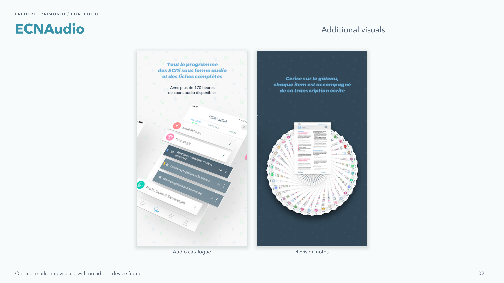

<picture>
<source media="(prefers-color-scheme: dark)" srcset="../assets/devaxes/logo-light.png">

</picture>

[← All projects](../README.md)

# ECNAudio

ECNAudio was an app for medical students preparing for the French national ranking examinations (ECN). It brought together nearly 200 hours of audio lessons and downloadable revision notes. The programme was organised by subject and topic, allowing students to find revision material and listen to it throughout the day. Background listening and offline access supported this mobile use, without requiring them to stay in the app or have a permanent network connection.

I was the React Native mobile developer responsible for the app, first at Big Boss Studio, then for a while as an independent contractor after leaving the agency. I worked on the audio playback experience, downloads, offline access, background listening and management of a large content catalogue.

## Skills

**Skills:** React Native · mobile development · audio playback · offline downloading · background playback.

## Portfolio

[Open the portfolio (PDF)](../assets/projets/ecnaudio/ecnaudio-portfolio.pdf)

## Gallery

[← All projects](../README.md)
