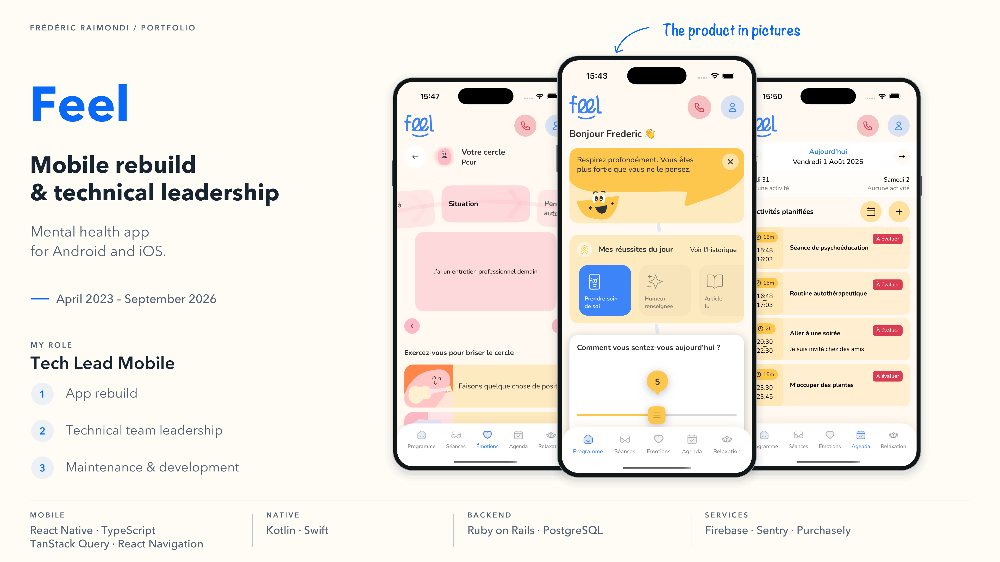

<picture>
<source media="(prefers-color-scheme: dark)" srcset="../assets/devaxes/logo-light.png">

</picture>

[← All projects](../README.md)

# Feel

Feel is a mobile mental health and wellbeing app. Its programme draws on cognitive behavioural therapies and combines videos, exercises and emotion tracking. The product requires clear user journeys, app reliability and the constraints of delivery on Android and iOS to work together. The app has reached tens of thousands of downloads on Google Play.

I was Tech Lead Mobile from April 2023 to September 2026. I led the rebuild of the Android and iOS apps, followed by their maintenance and ongoing development. My work covered the architecture and development of the React Native and TypeScript app, the native layers and mobile delivery.

## Skills

**Skills:** React Native · TypeScript · Kotlin · mobile architecture · technical leadership.

**Period:** April 2023 – September 2026.

## Portfolio

[Open the portfolio (PDF)](../assets/projets/feel/feel-portfolio-en-4a0fd9cdbc63.pdf)

## Gallery

[← All projects](../README.md)
