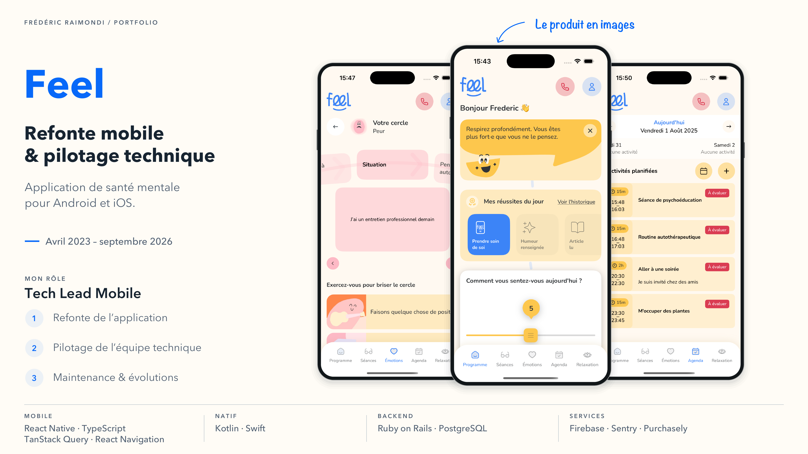
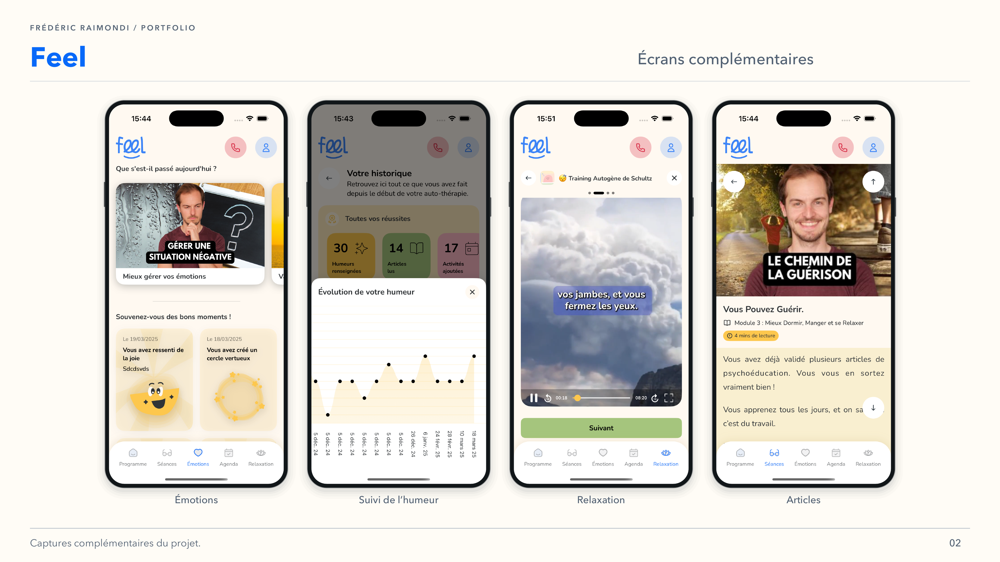

<picture>
<source media="(prefers-color-scheme: dark)" srcset="../assets/devaxes/logo-light.png">

</picture>

[← Tous les projets](../README.md)

# Feel

Feel est une application mobile de santé mentale et de bien-être. Son parcours s’appuie sur les thérapies cognitives et comportementales et associe vidéos, exercices et suivi des émotions. C’est un produit qui demande de faire tenir ensemble la clarté des parcours, la fiabilité de l’application et les contraintes de livraison sur Android et iOS. L’application a atteint des dizaines de milliers de téléchargements sur Google Play.

J’ai assuré le rôle de Tech Lead Mobile d’avril 2023 à septembre 2026. J’ai piloté la refonte des applications Android et iOS, puis leur maintenance et leurs évolutions. Mon intervention couvrait l’architecture et le développement de l’application React Native et TypeScript, les couches natives et la livraison mobile.

## Compétences

**Compétences :** React Native · TypeScript · Kotlin · architecture mobile · pilotage technique.

**Période :** avril 2023 – septembre 2026.

## Portfolio

[Ouvrir le portfolio (PDF)](../assets/projets/feel/feel-portfolio.pdf)

## Galerie

[← Tous les projets](../README.md)
