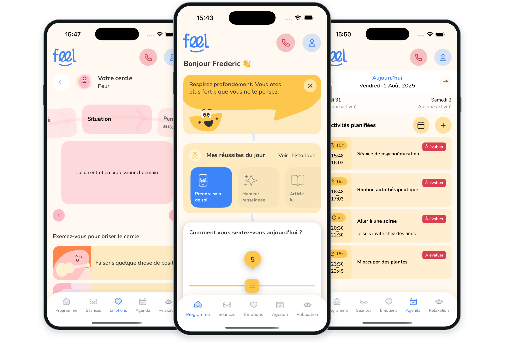
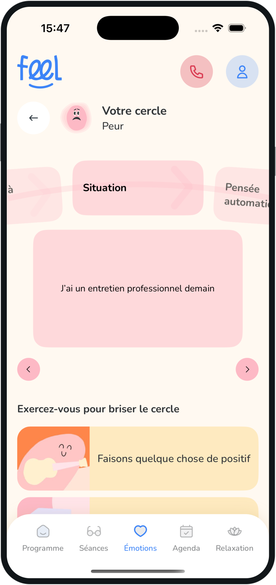
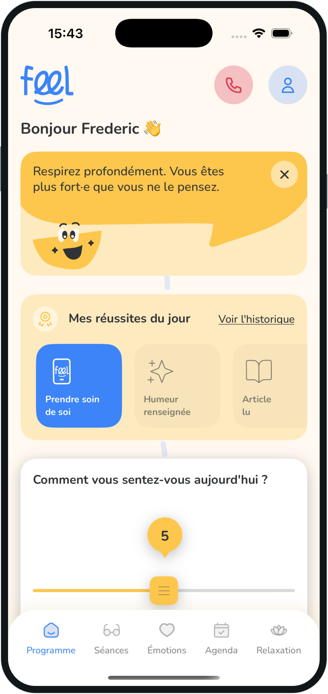
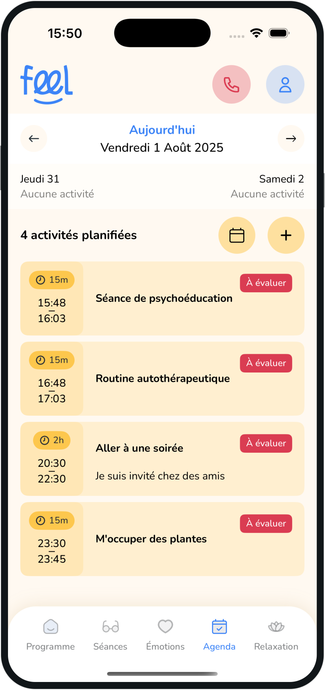
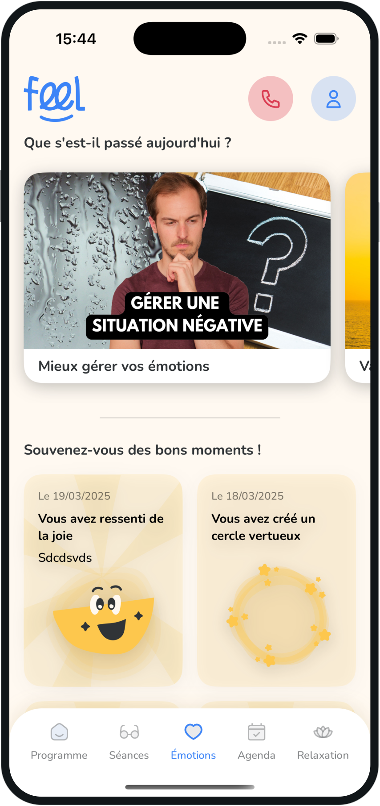
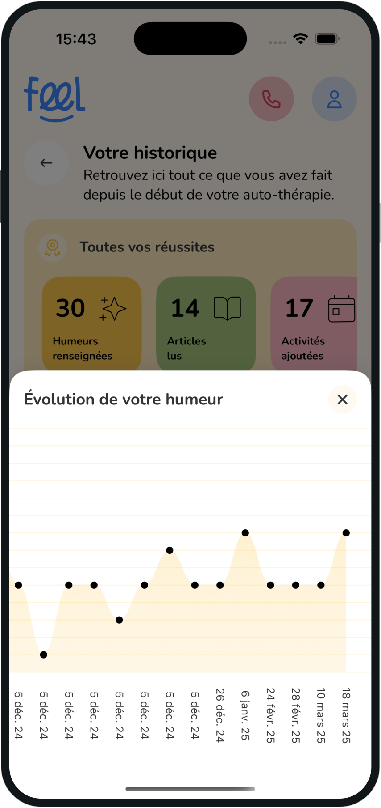
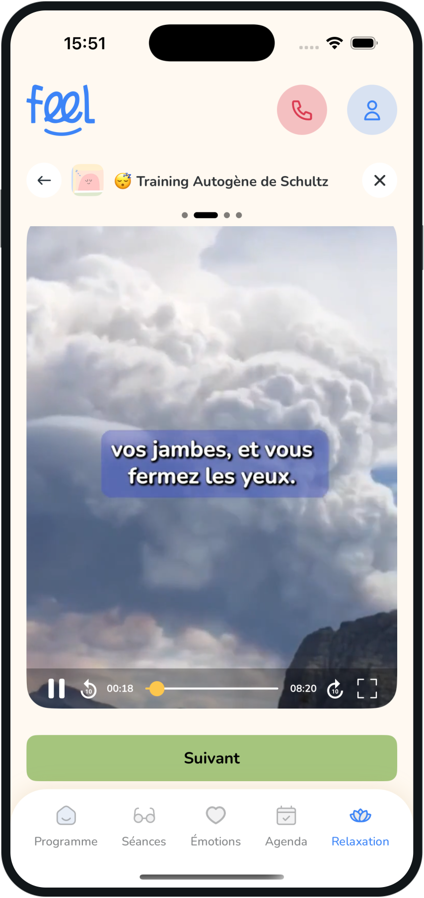
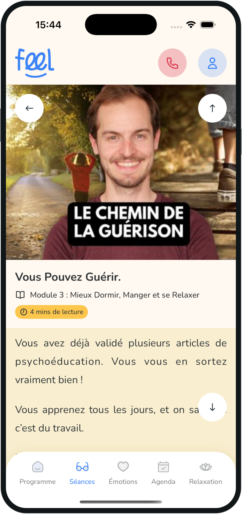

[Back to profile](../README.md) · [All work](README.md) · [Labs](../labs/README.md)

# Feel

Feel is a mental health app for Android and iOS. Its programme draws on cognitive behavioural therapies and combines videos, exercises and emotion tracking.

## My work

From April 2023 to September 2026, I led the entire technical function. I took on the Android/iOS rebuild, followed by maintenance and further product development.

The mobile app used React Native and TypeScript, with native layers in Kotlin and Swift. The backend used Ruby on Rails and PostgreSQL. My work covered development and maintenance of the APIs, database and administration, along with hosting, deployments and production releases.

## Stack

`React Native` `TypeScript` `Ruby on Rails` `PostgreSQL` `mobile and backend architecture` `technical leadership` `deployments`

**Period:** April 2023 – September 2026.

## Gallery

  

  

---

[devaxes.com](https://devaxes.com) · [LinkedIn](https://www.linkedin.com/in/freddev06/)
