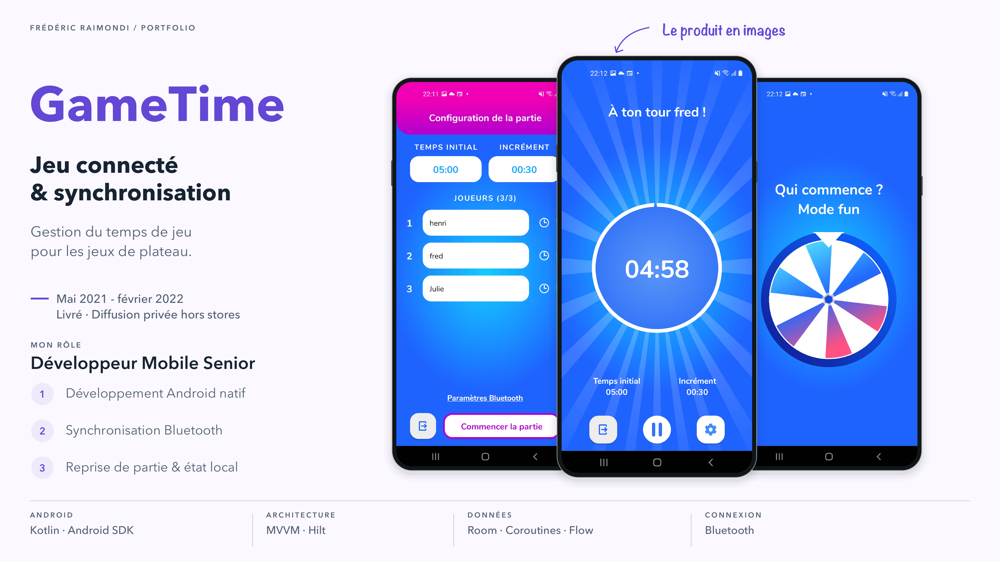
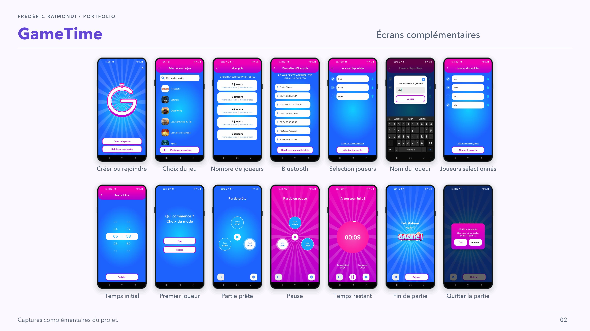

<picture>
<source media="(prefers-color-scheme: dark)" srcset="../assets/devaxes/logo-light.png">

</picture>

[← Tous les projets](../README.md)

# GameTime

GameTime est une application Android pour les jeux de plateau dont les tours se jouent avec un temps limité. Chaque joueur suit son temps restant et signale la fin de son tour avec un buzzer. Les appareils rejoignent la même partie en Bluetooth, ce qui permet de partager l’état du jeu entre les participants. Le parcours comprend la création d’une partie ou la connexion à une partie existante, le choix des joueurs et des réglages de temps, puis le déroulement de la session. Une partie peut reprendre après une déconnexion.

J’ai développé l’application Android native en Kotlin dans le cadre d’une mission menée de mai 2021 à février 2022. Mon travail couvrait l’architecture de l’application, les écrans de préparation et de jeu, la synchronisation Bluetooth et la reprise de partie. Le produit a été livré pour une diffusion privée, hors des stores.

## Compétences

**Compétences :** Kotlin · Android · Bluetooth · MVVM · Room.

**Période :** mai 2021 – février 2022.

## Portfolio

[Ouvrir le portfolio (PDF)](../assets/projets/gametime/gametime-portfolio.pdf)

## Galerie

[← Tous les projets](../README.md)
