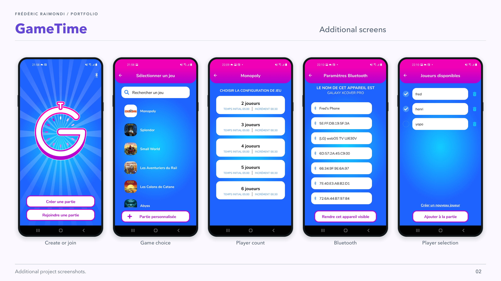

# GameTime

GameTime is an Android app for board games with time-limited turns. Each player tracks their remaining time and signals the end of their turn with a buzzer. Devices join the same game over Bluetooth, allowing the game state to be shared between participants. Players can create a game or join an existing one, choose players and time settings, then start playing. A game can resume after a disconnection.

## My work

I developed the native Android app in Kotlin as part of an engagement from May 2021 to February 2022. My work covered the app architecture, preparation and gameplay screens, Bluetooth synchronisation and game recovery. The product was delivered for private distribution outside the app stores.

## Stack

`Kotlin` `Android` `Bluetooth` `MVVM` `Room`

**Period:** May 2021 – February 2022.

## Screenshots

---

<a href="README.md">All mobile projects</a>

