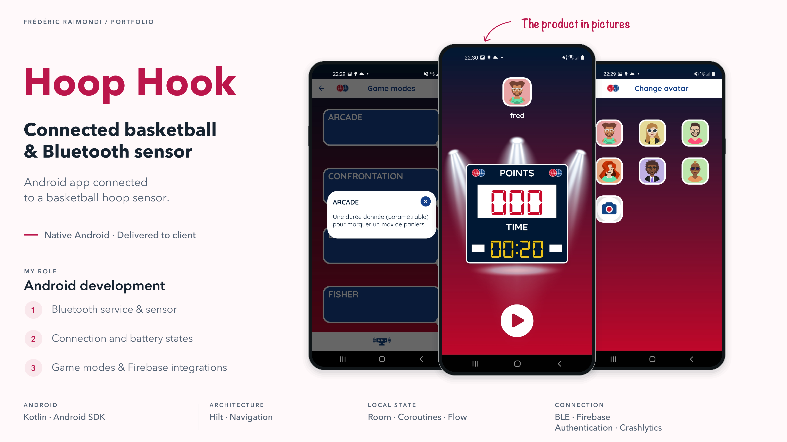
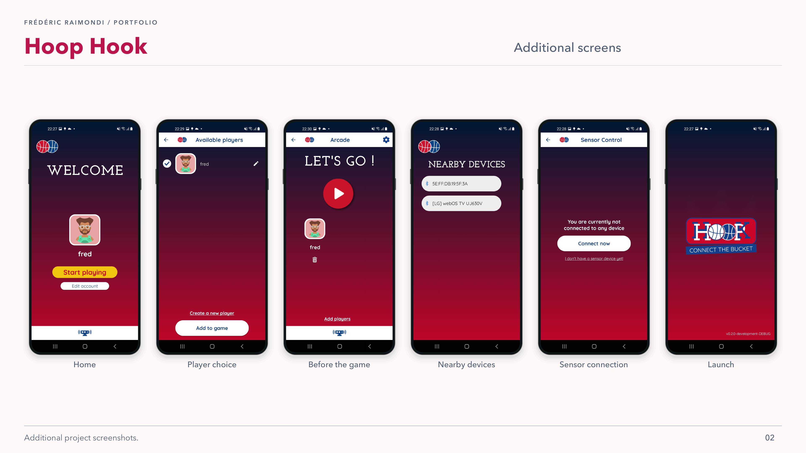

<picture>
<source media="(prefers-color-scheme: dark)" srcset="../assets/devaxes/logo-light.png">

</picture>

[← All projects](../README.md)

# Hoop Hook

Hoop Hook is a native Android app for a connected basketball device. It communicates with a sensor over Bluetooth Low Energy, monitors its state and offers several game modes. The mobile app manages the equipment connection, battery state and useful information during a session. The product was delivered to the client.

I contributed to Android development in Kotlin. I worked on the Bluetooth service, changes to sensor support, battery states, several game modes including Fisher, as well as Firebase authentication and notifications. This work connects game logic with the practical constraints of connected equipment.

## Skills

**Skills:** Kotlin · Android · Bluetooth Low Energy · Hilt · Firebase.

## Portfolio

[Open the portfolio (PDF)](../assets/projets/hoop-hook/hoop-hook-portfolio-en-ac2417d94e9d.pdf)

## Gallery

[← All projects](../README.md)
