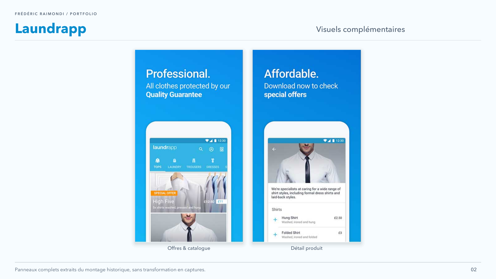

<picture>
<source media="(prefers-color-scheme: dark)" srcset="../assets/devaxes/logo-light.png">

</picture>

[← Tous les projets](../README.md)

# Laundrapp

Laundrapp proposait au Royaume-Uni un service de blanchisserie et de pressing à la demande, avec collecte puis livraison des vêtements. Le mobile couvrait deux usages distincts : côté client, commander et suivre le service ; côté livreurs, prendre en charge les commandes, organiser les tournées et partager la position pendant les trajets. Ce second parcours devait s’articuler avec les opérations sur le terrain et avec un parc de terminaux Android gérés par l’entreprise.

J’ai travaillé chez Laundrapp à Londres de mars 2015 à mars 2016 comme Développeur Android Senior. J’étais responsable du développement et de la maintenance de l’application Android client, distribuée sur Google Play et l’Amazon Appstore. J’ai aussi conçu et développé de zéro l’application Android destinée aux livreurs, avec la prise de commandes, les tournées et le suivi de position. Mon travail comprenait les analytics, le suivi des crashs, les feature flags et les builds automatisés. Avec les équipes opérationnelles, j’ai travaillé sur la gestion du parc de terminaux, notamment sur les outils Android de contrôle et de provisioning NFC.

## Compétences

**Compétences :** Android · Java · Google Maps · provisioning NFC · CI/CD mobile.

**Période :** mars 2015 – mars 2016.

## Portfolio

[Ouvrir le portfolio (PDF)](../assets/projets/laundrapp/laundrapp-portfolio.pdf)

## Galerie

[← Tous les projets](../README.md)
