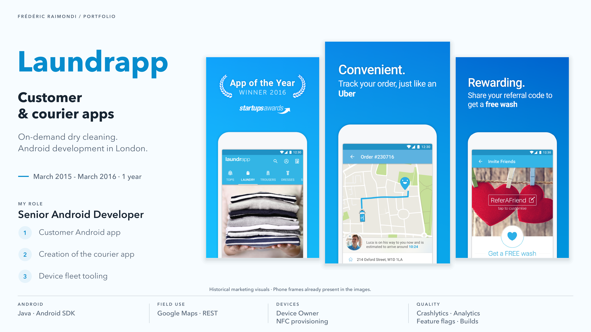
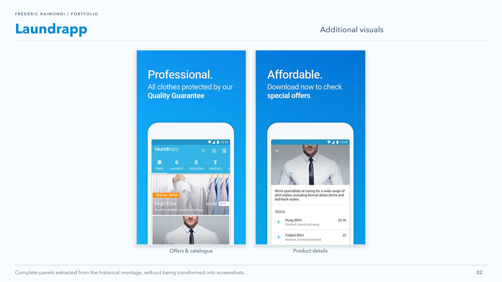

<picture>
<source media="(prefers-color-scheme: dark)" srcset="../assets/devaxes/logo-light.png">

</picture>

[← All projects](../README.md)

# Laundrapp

Laundrapp offered on-demand laundry and dry cleaning in the United Kingdom, with collection and delivery of clothes. Mobile served two distinct uses: customers ordering and tracking the service; couriers handling orders, organising routes and sharing their location while travelling. This second journey had to fit into field operations and a fleet of company-managed Android devices.

I worked at Laundrapp in London from March 2015 to March 2016 as a Senior Android Developer. I was responsible for developing and maintaining the customer Android app, distributed on Google Play and the Amazon Appstore. I also designed and built the courier Android app from scratch, with order handling, routes and location tracking. My work included analytics, crash reporting, feature flags and automated builds. With the operations teams, I worked on device fleet management, particularly Android control tools and NFC provisioning.

## Skills

**Skills:** Android · Java · Google Maps · NFC provisioning · mobile CI/CD.

**Period:** March 2015 – March 2016.

## Portfolio

[Open the portfolio (PDF)](../assets/projets/laundrapp/laundrapp-portfolio-en-2896e66c4d76.pdf)

## Gallery

[← All projects](../README.md)
