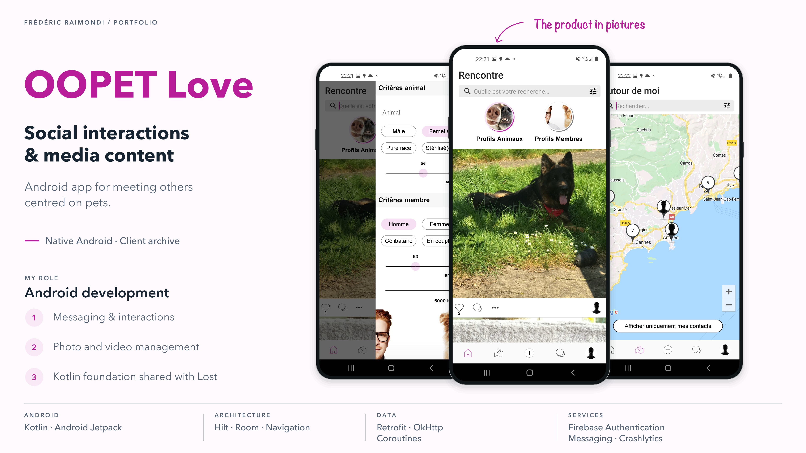
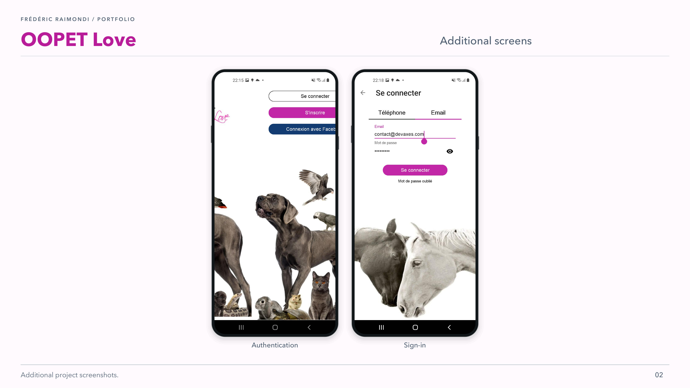

<picture>
<source media="(prefers-color-scheme: dark)" srcset="../assets/devaxes/logo-light.png">

</picture>

[← All projects](../README.md)

# OOPET Love

OOPET Love is a social Android app centred on pets and their owners. It brings together profiles and interactions, messaging, and journeys for selecting and sharing photos and videos. The project belonged to a set of products for the same client: OOPET Love and OOPET Lost are two distinct apps that shared a common Kotlin library.

I worked on the Android app in Kotlin, particularly messaging, photo and video media management, the media selection component and app versioning.

## Skills

**Skills:** Kotlin · Android Jetpack · mobile messaging · media management · Firebase.

## Portfolio

[Open the portfolio (PDF)](../assets/projets/oopet-love/oopet-love-portfolio-en-995b86f61836.pdf)

## Gallery

[← All projects](../README.md)
