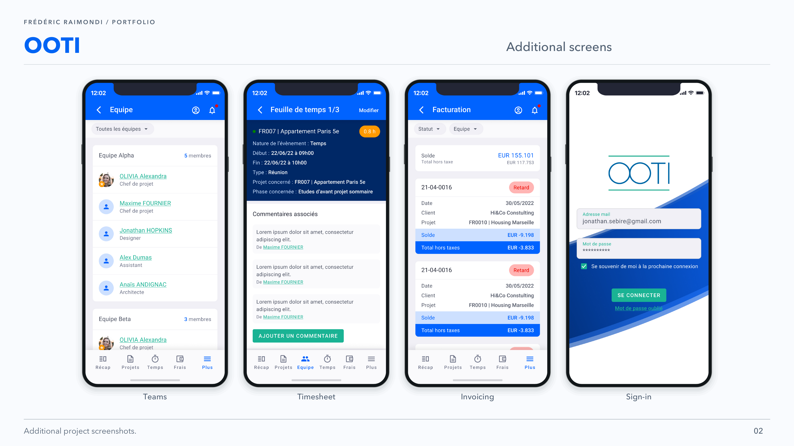

<picture>
<source media="(prefers-color-scheme: dark)" srcset="../assets/devaxes/logo-light.png">

</picture>

[← All projects](../README.md)

# OOTI

OOTI is an ERP for architecture firms. Its mobile app supports tasks also performed away from the office: tracking projects, recording time, entering expenses and supporting documents, reviewing invoices or handling approvals. These data then feed project management and profitability. In 2026, the publisher reported that the product was used by nearly a thousand architecture firms.

I worked as a Senior Mobile Developer from June 2022 to January 2023 to take over and rebuild the iOS and Android apps. I established the React Native and TypeScript architecture, navigation and components, then developed project, time, expense, invoice and approval workflows connected to a REST API. Business state was persisted locally and synchronised with that API. I also worked on authentication, permissions, adding supporting documents and CI/CD pipelines with Fastlane and Bitrise for mobile deliveries.

## Skills

**Skills:** React Native · TypeScript · Redux/Saga · REST API · mobile CI/CD.

**Period:** June 2022 – January 2023.

## Portfolio

[Open the portfolio (PDF)](../assets/projets/ooti/ooti-portfolio.pdf)

## Gallery

[← All projects](../README.md)
