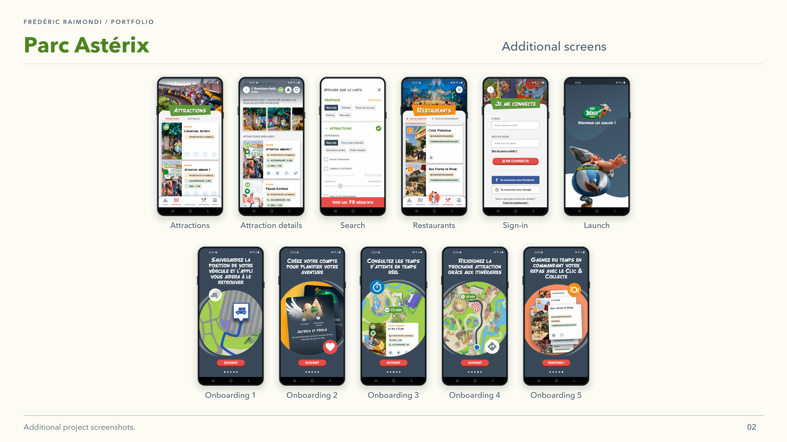

<picture>
<source media="(prefers-color-scheme: dark)" srcset="../assets/devaxes/logo-light.png">

</picture>

[← All projects](../README.md)

# Application Parc Astérix

The official Parc Astérix app accompanies visitors during their visit. It brings together a park map, search and filters, attractions and food services. These journeys must remain clear on site, when visitors are looking for a place or information in the middle of a visit. The React Native app runs on Android and iOS, with mapping, geolocation and business-service integrations.

From September 2021 to March 2022, I worked as a subcontractor for Big Boss Studio to maintain and develop this existing app. I worked on the full-screen map, search and filters, restaurants and terraces, attraction headers, authenticated links and integration updates, within an existing React Native and TypeScript codebase.

## Skills

**Skills:** React Native · TypeScript · GraphQL · mobile mapping · Firebase.

**Period:** September 2021 – March 2022.

## Portfolio

[Open the portfolio (PDF)](../assets/projets/parc-asterix/parc-asterix-portfolio.pdf)

## Gallery

[← All projects](../README.md)
