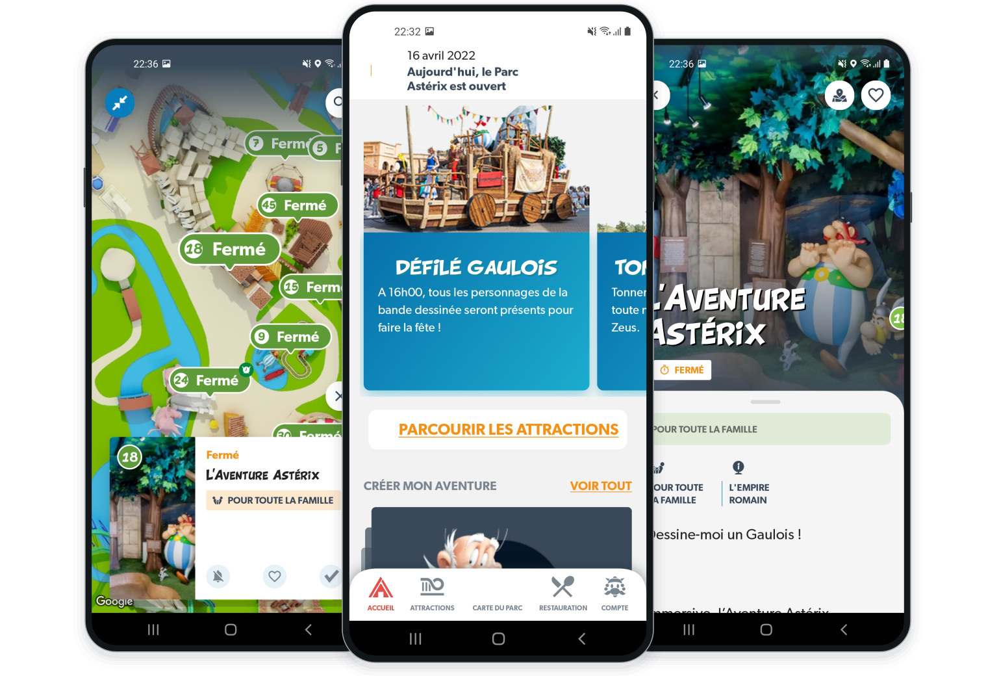
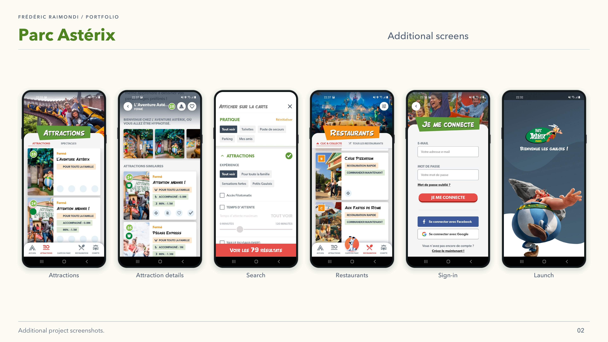

# Application Parc Astérix

The official Parc Astérix app accompanies visitors during their visit. It brings together a park map, search and filters, attractions and food services. Visitors use it on site to find places and practical information. The React Native app runs on Android and iOS, with mapping, geolocation and business-service integrations.

## My work

From September 2021 to March 2022, I worked as a subcontractor for Big Boss Studio to maintain and develop this existing app. I worked on the full-screen map, search and filters, restaurants and terraces, attraction headers, authenticated links and integration updates, within an existing React Native and TypeScript codebase.

## Stack

`React Native` `TypeScript` `GraphQL` `mobile mapping` `Firebase`

**Period:** September 2021 – March 2022.

## Screenshots

---

<a href="README.md">All mobile projects</a>

