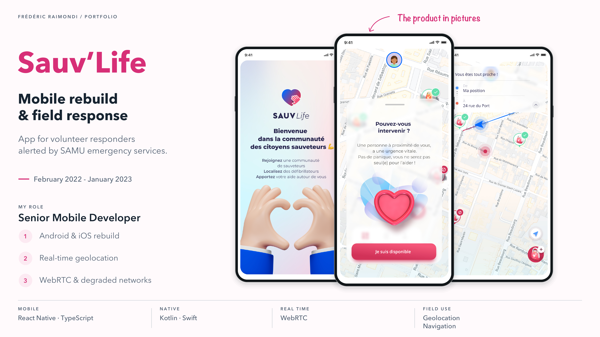
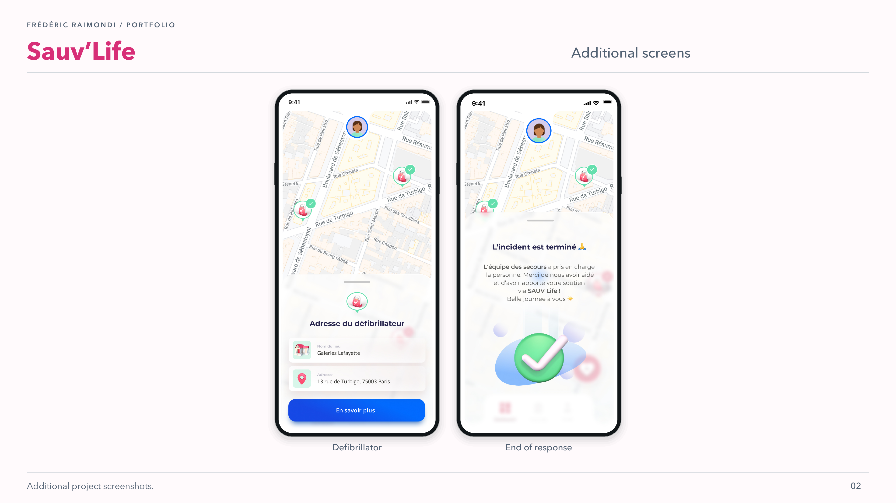

<picture>
<source media="(prefers-color-scheme: dark)" srcset="../assets/devaxes/logo-light.png">

</picture>

[← All projects](../README.md)

# Sauv'Life

Sauv’Life is an app for volunteer responders mobilised at the request of French emergency medical services (SAMU). When a response is triggered, the mobile journey lets them receive the request, locate themselves, reach the relevant site and access useful information while travelling. The app also provides defibrillator location and an end-of-response journey. It has reached hundreds of thousands of downloads on Google Play.

From February 2022 to January 2023, I worked as a subcontractor for Big Boss Studio on the Android and iOS rebuild. I worked on geolocation, real-time navigation, communication through WebRTC and operation on degraded networks.

## Skills

**Skills:** React Native · TypeScript · geolocation · WebRTC · operation on degraded networks.

**Period:** February 2022 – January 2023.

## Portfolio

[Open the portfolio (PDF)](../assets/projets/sauvlife/sauvlife-portfolio.pdf)

## Gallery

[← All projects](../README.md)
