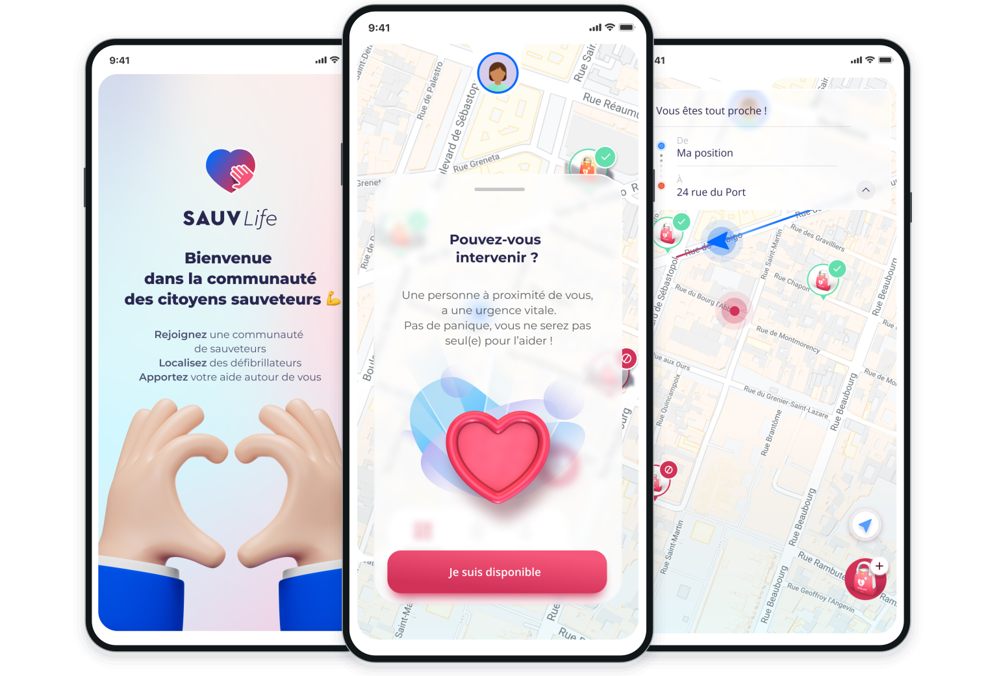
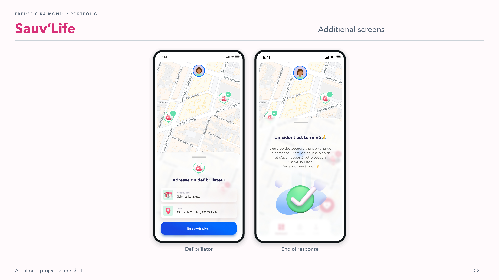

# Sauv'Life

Sauv’Life is an app for volunteer responders mobilised at the request of French emergency medical services (SAMU). When a response is triggered, the app lets them receive the request, locate themselves, reach the relevant site and access useful information while travelling. The app also provides defibrillator location and a flow to close the response. It has reached hundreds of thousands of downloads on Google Play.

## My work

From February 2022 to January 2023, I worked as a subcontractor for Big Boss Studio on the Android and iOS rebuild. I worked on geolocation, real-time navigation, communication through WebRTC and operation on degraded networks.

## Stack

`React Native` `TypeScript` `geolocation` `WebRTC` `operation on degraded networks`

**Period:** February 2022 – January 2023.

## Screenshots

---

<a href="README.md">All mobile projects</a>

