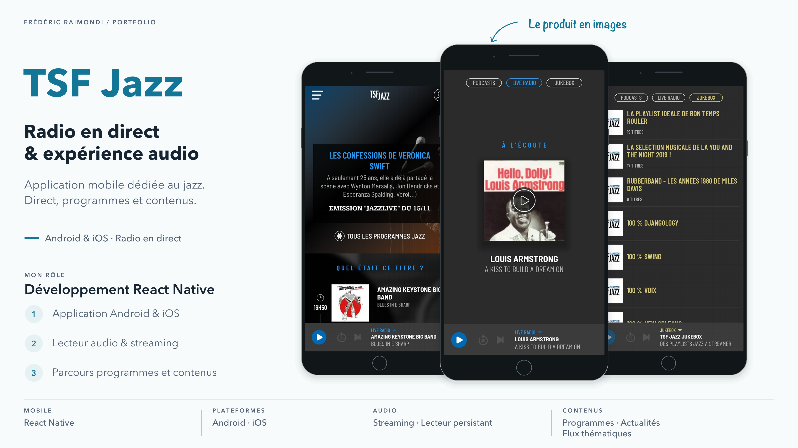
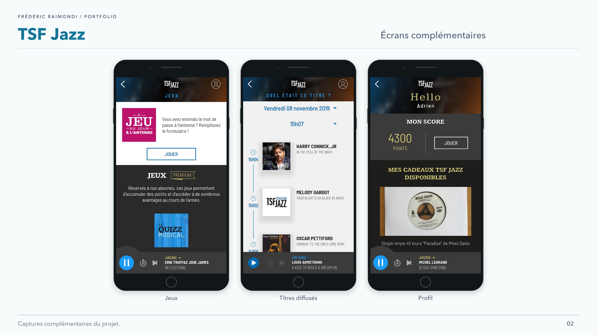

<picture>
<source media="(prefers-color-scheme: dark)" srcset="../assets/devaxes/logo-light.png">

</picture>

[← Tous les projets](../README.md)

# TSF Jazz

L’application mobile de TSF Jazz réunit la radio en direct et des contenus à écouter à la demande. Elle permet de passer du flux live aux podcasts et aux flux thématiques, tout en donnant accès aux programmes et aux contenus éditoriaux de la station. Son lecteur reste accessible pendant la navigation dans l’application, sur iOS comme sur Android.

Chez Big Boss Studio, j’ai été le développeur mobile React Native en charge de ce chantier applicatif. J’ai travaillé sur les parcours du lecteur, l’intégration du streaming, les podcasts et les flux thématiques, en lien avec les équipes produit et design.

## Compétences

**Compétences :** React Native · iOS · Android · streaming audio · lecteur média.

## Portfolio

[Ouvrir le portfolio (PDF)](../assets/projets/tsf-jazz/tsf-jazz-portfolio.pdf)

## Galerie

[← Tous les projets](../README.md)
