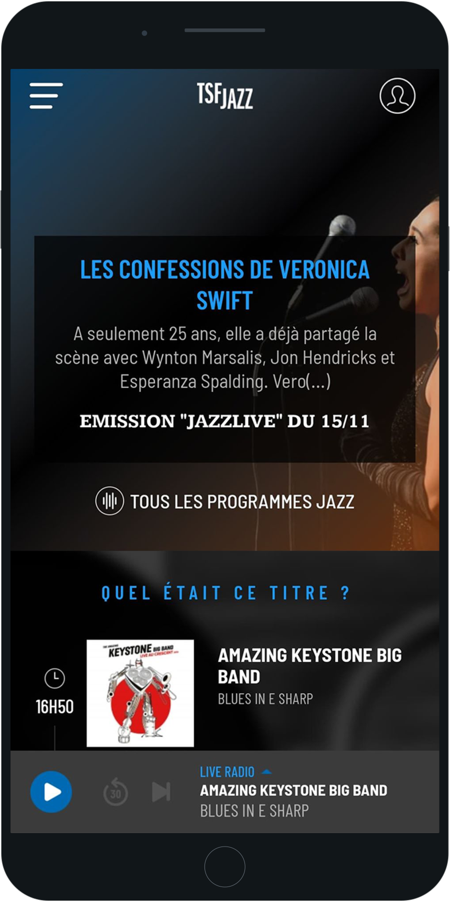
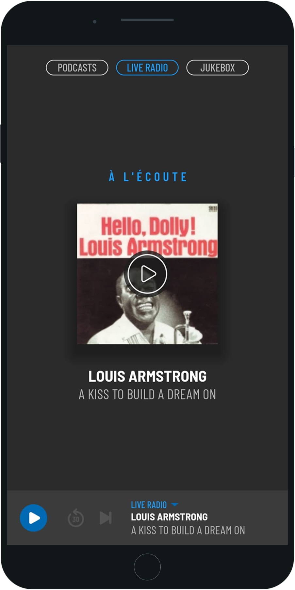
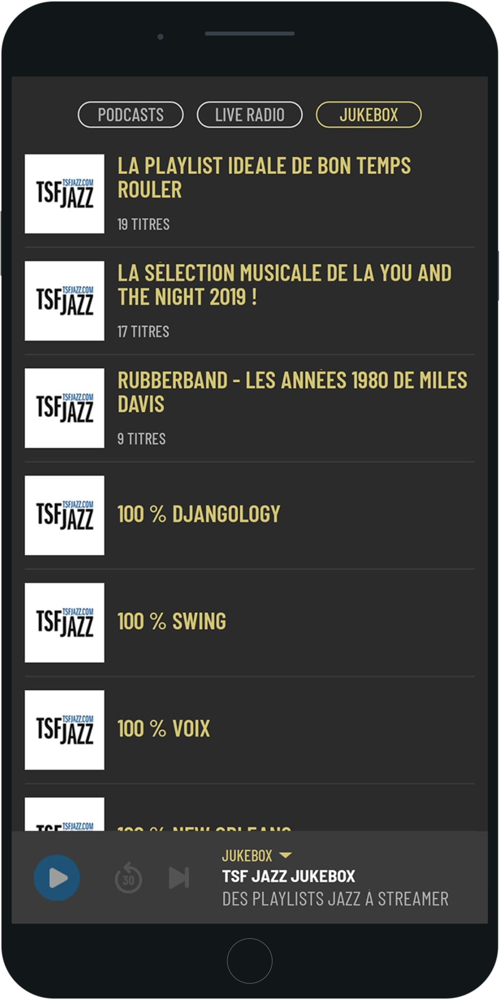
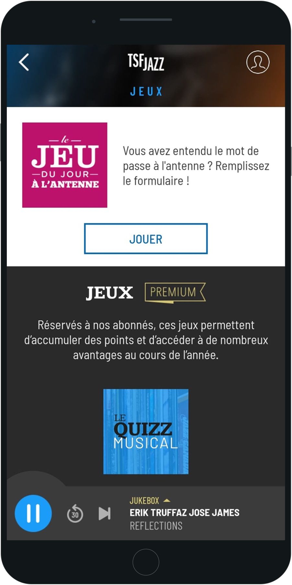
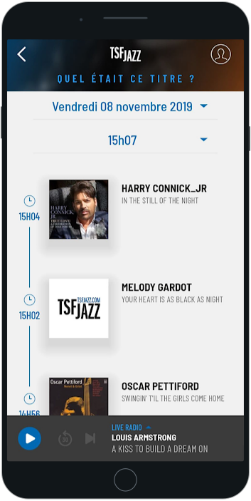
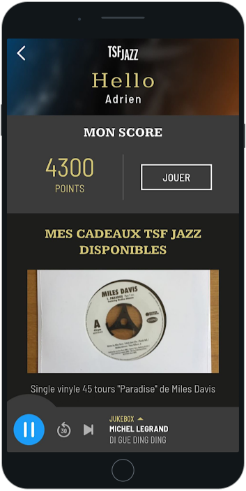

[Back to profile](../README.md) · [All work](README.md) · [Labs](../labs/README.md)

# TSF Jazz

The TSF Jazz mobile app brings together live radio and on-demand listening content. It allows listeners to move from the live stream to podcasts and themed streams, while providing access to the station's programmes and editorial content. Its player remains accessible while navigating the app, on both iOS and Android.

## My work

At Big Boss Studio, I was the React Native mobile developer responsible for this app development work. I worked on the audio player, streaming integration, podcasts and themed streams, in collaboration with the product and design teams.

## Stack

`React Native` `iOS` `Android` `audio streaming` `media player`

## Gallery

  

  

---

[devaxes.com](https://devaxes.com) · [LinkedIn](https://www.linkedin.com/in/freddev06/)
